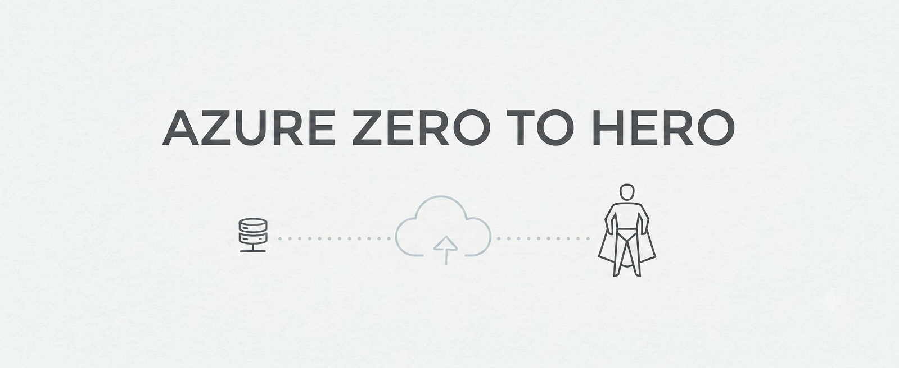

  

 

# Azure AZ-305 — Zero to Hero

### ☁️ From Azure architecture fundamentals to enterprise solution design — comprehensive explanations, architecture patterns, hands-on labs, and real-world scenarios.

---

## 📖 About This Repository

**Azure AZ-305 — Zero to Hero** is a structured, architecture-focused learning repository designed to build the skills required to design secure, scalable, reliable, performant, and cost-effective solutions on Microsoft Azure.

Every section is organized into its own folder with a dedicated `README.md` covering in-depth architecture concepts, diagrams, service comparisons, architecture decisions, hands-on labs, and real-world scenarios. The content progresses logically — from architecture fundamentals and governance to enterprise networking, compute, application architecture, data solutions, business continuity, and migration.

By the end of this course, you will be able to:

- ✅ Translate business and technical requirements into Azure solution architectures
- ✅ Apply the Azure Well-Architected Framework to design reliable, secure, performant, and cost-effective solutions
- ✅ Design cloud adoption strategies using the Cloud Adoption Framework and Azure Landing Zones
- ✅ Design enterprise identity, governance, authorization, and security architectures
- ✅ Design secure and highly available Azure network architectures using Hub-Spoke, Virtual WAN, Private Link, VPN, ExpressRoute, and Azure Firewall
- ✅ Select the appropriate compute platform using Virtual Machines, VM Scale Sets, App Service, Containers, AKS, Functions, and Azure Batch
- ✅ Design scalable application architectures using APIs, caching, messaging, event-driven patterns, and serverless technologies
- ✅ Design relational, NoSQL, storage, and data platform solutions based on workload requirements
- ✅ Design high availability, backup, disaster recovery, and multi-region solutions using RPO and RTO requirements
- ✅ Plan Azure migration and modernization strategies using Azure Migrate and the Cloud Adoption Framework
- ✅ Design centralized monitoring, logging, and observability solutions using Azure Monitor, Log Analytics, and Application Insights
- ✅ Evaluate Azure services, architecture alternatives, trade-offs, performance, security, reliability, and cost before making design decisions
- ✅ Document architecture decisions using Architecture Decision Records (ADRs)
- ✅ Build real-world Azure solution architectures through hands-on labs, scenarios, and projects

---
